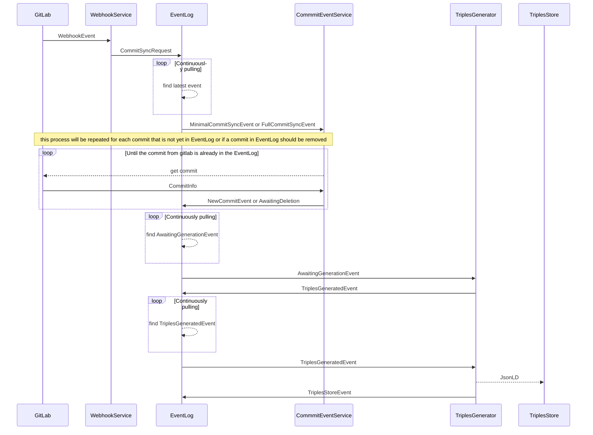
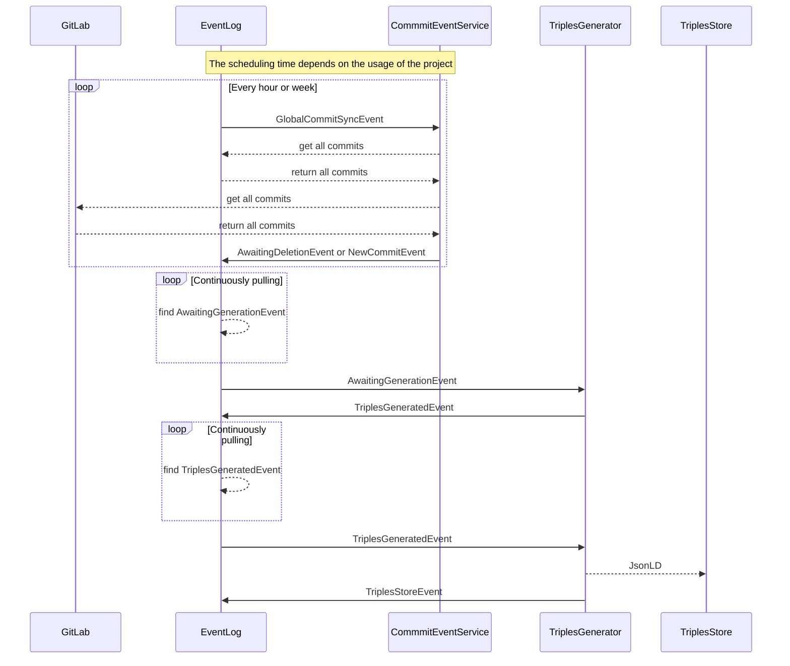

\[](https://pullreminders.com?ref=badge)

# renku-graph

#### Repository structure

- `helm-chart` helm charts for publishing with chartpress
- `generators` a set of common use scalacheck generators
- `tiny-types` a module containing tooling for Tiny Types
- `graph-commons` common classes for all the services
- `renku-model` defines both production and testing Renku metadata model
- `webhook-service` a microservice managing GitLab hooks and incoming external events
- `event-log` a microservice responsible for events management
- `commit-event-service` a microservice synchronizing commit events between KG and GitLab
- `triples-generator` a microservice generating, transforming and taking care of data in the Triples Store
- `token-repository` a microservice managing projects' Access Tokens
- `acceptance-tests` acceptance tests for the services

#### Running the tests

```bash
sbt clean test && sbt "project acceptance-tests" test
```

Depending on your global configuration of sbt you have installed, you might need to set `SBT_OPTS` to avoid OutOfMemory exception. 
If such error is raised, try setting the variable with the following:

```bash
export SBT_OPTS="-Xmx2G -Xss5M"
```

#### Development

###### Coding molds

Renk Graph was built with code readability and maintainability as a value. We believe that high coding standards can:
* reduce time needed for adding new features;
* reduce number of bugs;
* lower cognitive load for developers;
* make the work with the code more fun ;)

Hence, we are trying to find and then follow good patterns in naming, code organization on a method, class, package and module level. The following list has a work-in-progress style is it supposed to be in constant improvement.
* `camelCase` notation is used everywhere in Scala code;
* the lower scope of a variable, method, class, package, the shorter, less descriptive name can be;
* readability has always a higher value than succinctness;
* `class`es should rather have noun names;
* `class`es names should rather not be comprised of more than three words;
* `def`s should be verbs;
* `def`s should rather be very short (let's keep it an exception for a `def` having more than 10 lines);
* `class`es should rather be short;
* `class`es and `def`s should be having single purpose;
* nesting `if`s or any other structures should not exceed three levels; preferable one level of nesting should be used;
* great attention should be paid to the scopes on all levels and as a rule it's preferable that the visibility is kept as low as possible;
* variables should rather be defined the closest possible the usage; we don't follow the old way of top-variables-definition-block as it's hard to see the aim of a variable;
* ADTs (Abstract Data Types) are used everywhere to make compiler preventing accidental mixing up different domain values; only in very exceptional cases that can be lifted;
* `implicit`s and Context Bound should/may be used extensively but wisely;
* `show` String Interpolator should be the first choice over the `s` and `toString`; 
* obviously the rules above can be always lifted if favour of readability;
* code should be formatted with the rules defined in the `.scalafmt.conf` file;
* once code readability issue is found, it should be either fix straight away or an issue should be created.

#### Releasing

The standard release process is done manually.

#### Hotfixes

In a case of hotfixes, changes to a relevant commit/tag needs to be done and pushed to a special branch with name
following the `hotfix-<major>.<minor>` pattern. Once the fix is pushed, CI will test the change with other Renku
services. Tagging has to be done manually.

### Event Flow

This section describes the flow of events starting from a commit on GitLab until the data is stored in the triples
store. The solid lines represent an event being sent and the dotted lines represent non-event-like data (request or
response).

#### Project creation flow and new commit flow

When a project is created on GitLab or a new commit is pushed to GitLab the following flow is triggered:
A `MinimalCommitSyncEvent` is created if a new project is created and a `FullCommitSyncEvent` is created when a new
commit is pushed.



#### Global Commit Sync flow:

This flow traverses the whole commit history of a project and find out:

1. if there are commits on GitLab that need to be created on the `Eventlog`
2. if there are commits that are not on GitLab that should be removed from the `EventLog`

This process is scheduled to be triggered at a minimum rate of once per week per project and at a maximum rate of once
per hour per project. The commit history traversal only begins when the number of commits on GitLab and on
the `EventLog` does not match and the most recent commit on GitLab is different from the most recent commit on
the `EventLog`.


##### The removal (re-provisioning) of a project

Once an event is marked as AwaitingDeletion it is automatically picked up by our process and a CleanUp event is created. 
This event triggers the removal of the project in the Triple Store. The clean up of a project can be either the removal of the projects with all its events and entities (if the project was removed from GitLab) or the re-provisioning of the project (if there are events which are not AwaitingDeletion).

###### Removing Project Triples

The removal of project triples happens in two steps:
 - Updating links
 - Removing all entities

Updating links happens in order to not create island in our graph. An example would be with a hierarchy of forked projects:

`project1 <-- project2 <-- project3`

If we wanted to remove project2 we would have to re-link project3 to project1.

`project1 <-- project3`

The update of the links would also be applied to the Dataset entities which could be imported from other Datasets(similar to a fork for a project).

After the re-linking, the project and all its dependant entities can be removed. These entities will be removed only if they are not used in another project.
