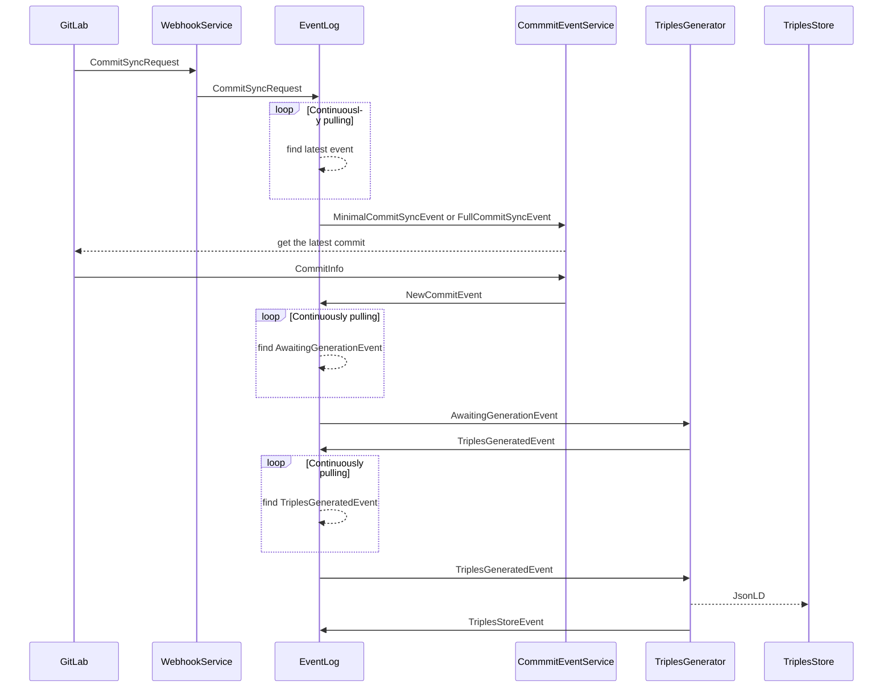
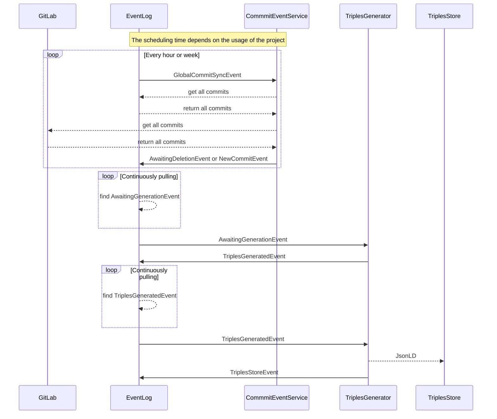

[](https://pullreminders.com?ref=badge)

# renku-graph

#### Repository structure

- `helm-chart` helm chart, published using chartpress
- `graph-commons` common classes for all the services
- `acceptance-tests` acceptance tests for the services
- `webhook-service` a microservice managing Graph Services hooks and external events
- `commit-event-service` a microservice synchronizing commit events
- `event-log` a microservice providing CRUD operations on the Event Log
- `triples-generator` a microservice translating Event Log events to RDF triples in an RDF store
- `token-repository` a microservice managing Access Tokens for projects

#### Running the tests

```bash
sbt clean test && sbt "project acceptance-tests" test
```

Depending on your global configuration of sbt you have installed, you might need to set `SBT_OPTS` to avoid OutOfMemory exception. 
If such error is raised, try setting the variable with the following:

```bash
export SBT_OPTS="-XX:+UseG1GC -XX:+CMSClassUnloadingEnabled -Xmx2G"
```

#### Releasing

The standard release process is done manually.

#### Hotfixes

In a case of hotfixes, changes to a relevant commit/tag needs to be done and pushed to a special branch with name
following the `hotfix-<major>.<minor>` pattern. Once the fix is pushed, CI will test the change with other Renku
services. Tagging has to be done manually.

### Event Flow

This section describes the flow of events starting from a commit on GitLab until the data is stored in the triples
store. The solid lines represent an event being sent and the dotted lines represent non-event-like data (request or
response).

#### Project creation flow and new commit flow

When a project is created on GitLab or a new commit is pushed to GitLab the following flow is triggered:
A MinimalCommitSyncEvent is created if a new project is created and a FullCommitSyncEvent is created when a new commit
is pushed.



#### Global Commit Sync flow:

This flow allows removal or creation of commits anywhere in the commit history. It is scheduled to be triggered at a
minimum rate of once per week per project and at a maximum rate of once per hour per project. This process will only
begin if a change in the history is detected.




